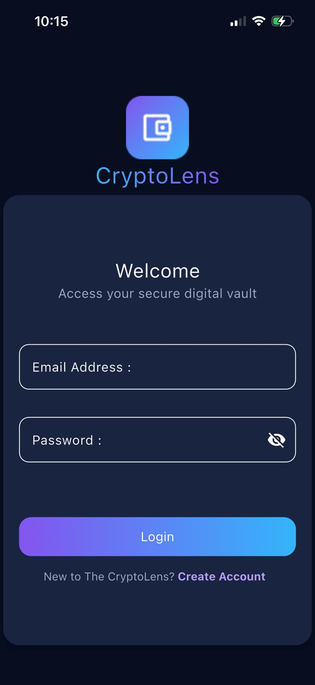
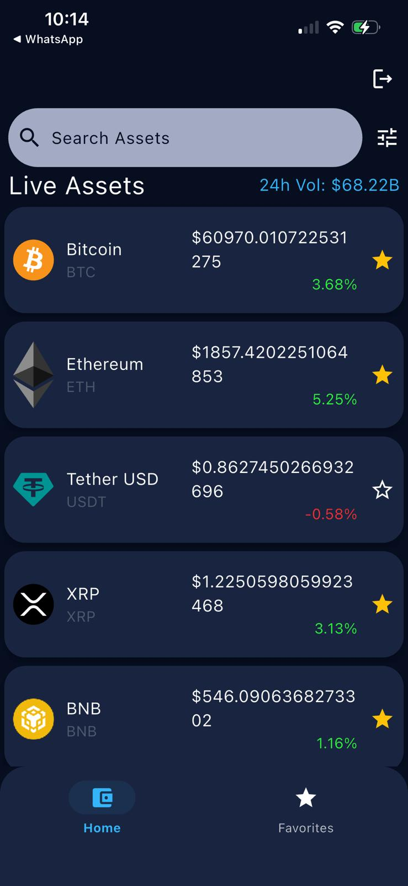
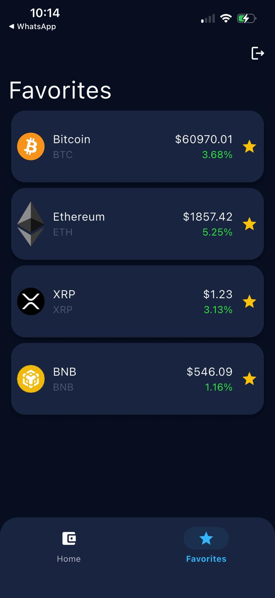
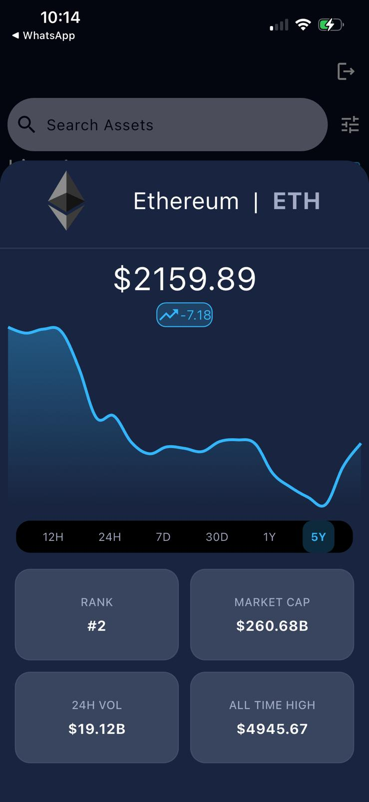

#  CryptoLens

CryptoLens, gerçek zamanlı kripto para verilerini takip etmenizi sağlayan, modern mimari prensipleriyle (BLOC) geliştirilmiş, performans odaklı bir Flutter uygulamasıdır. Kullanıcı dostu arayüzü ve akıllı veri yönetimi ile kripto dünyasını parmaklarınızın ucuna getirir.

---

## 📸 Screenshots

Uygulamanın arayüzüne ve özelliklerine kısa bir bakış:

| Login & Register | Home View | Search & Filter |
| :---: | :---: | :---: |
|  |  |  |

| Favorites List | Coin Details (Chart) | Logout Flow |
| :---: | :---: | :---: |
|  |  |  |

---

## 🚀 Öne Çıkan Özellikler

* **Supabase Integration:** Kullanıcı kimlik doğrulama (Auth) ve uzak veri senkronizasyonu için güvenli backend altyapısı.
* **Real-Time Data Fetching:** Coinranking API entegrasyonu ile canlı fiyat takibi.
* **Advanced Filtering:** Coinleri fiyat, market hacmi ve değişim oranına göre anlık sıralama.
* **Favorite System:** Hive ile yerel depolama desteği; internet olmasa bile favorilerinize erişin.
* **Detailed Analytics:** Seçilebilir zaman aralıklarıyla (1h, 24h, 7d vb.) etkileşimli fiyat grafikleri.
* **Clean Architecture & BLoC:** Uygulama durumu (state), mantık ve UI katmanlarının tam ayrımı.

---

## 🛠 Kullanılan Teknolojiler & Kütüphaneler

Uygulama, modern Flutter ekosisteminin en güçlü araçları kullanılarak inşa edilmiştir:

* **State Management:** `flutter_bloc` & `equatable` (Öngörülebilir ve test edilebilir durum yönetimi).
* **Local Database:** `hive` & `hive_flutter` (Hızlı ve güvenilir yerel veri saklama).
* **Networking:** `dio` (Gelişmiş HTTP istek yönetimi).
* **Reactive Programming:** `rxdart` (Search ve filtreleme işlemlerinde debounce yönetimi).
* **UI Components:** `fl_chart` (Zengin içerikli kripto grafikleri için).
* **Dependency Injection:** `get_it` (Servis ve Repository yönetimi).
* **Architecture:** Clean Architecture prensiplerine uygun klasör yapısı ve `Result` pattern kullanımı.

